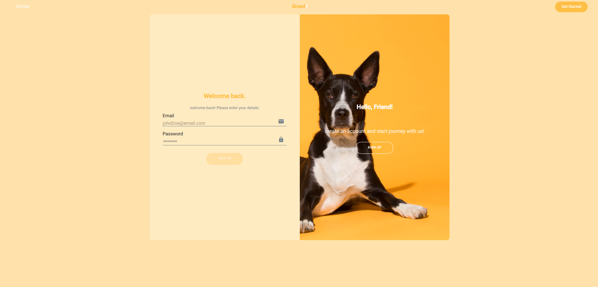

<div align="center">
<h1 style="color:#FEBB59">Breed<span style="color: white">r</span></h1>
  <p align="center">
    The first ever website for animal breeding!
    <br />
  </p>
</div>
<details>
  <summary>Table of Contents</summary>
  <ol>
    <li><a href="#contributors">Contributors</a></li>
    <li>
      <a href="#about-the-project">About The Project</a>
      <ul>
        <li><a href="#built-with">Built With</a></li>
      </ul>
    </li>
    <li>
      <a href="#getting-started">Getting Started</a>
      <ul>
        <li><a href="#prerequisites">Prerequisites</a></li>
        <li><a href="#installation">Installation</a></li>
      </ul>
    </li>
    <li><a href="#usage">Usage</a></li>
  </ol>
</details>

## Contributors
This project was made possible through the efforts of :
* Ala Ben Hamouda
* Azer Chabbar
* Khalil Ben Abdallah
* Omar Maaref
* Taoufik Kaabi
## About The Project 

Breedr allows its users to add their animals and control who they breed with as they wish.
### Built With
* frameworks used in this project:
[][Angular-url]
[][Bootstrap-url]
[][NestJS-url]
<!-- MARKDOWN LINKS & IMAGES -->
<!-- https://www.markdownguide.org/basic-syntax/#reference-style-links -->
[Angular-url]: https://angular.io/
[Bootstrap-url]: https://getbootstrap.com
[NestJs-url]: https://nestjs.com
## Getting Started 
Here is a step-by-step walkthrough on how to step the project on your device: 
### Prerequisites
For development, you will only need Node.js and a node global package, Yarn, installed in your environement.

### Node
- #### Node installation on Windows

  Just go on [official Node.js website](https://nodejs.org/) and download the installer.
  Also, be sure to have `git` available in your PATH, `npm` might need it (You can find git [here](https://git-scm.com/)).

- #### Node installation on Ubuntu

  You can install nodejs and npm easily with apt install, just run the following commands.

      $ sudo apt install nodejs
      $ sudo apt install npm

- #### Other Operating Systems
  You can find more information about the installation on the [official Node.js website](https://nodejs.org/) and the [official NPM website](https://npmjs.org/).

If the installation was successful, you should be able to run the following command.

    $ node --version
    v8.11.3

    $ npm --version
    6.1.0

If you need to update `npm`, you can make it using `npm`! Cool right? After running the following command, just open again the command line and be happy.

    $ npm install npm -g

###
### Yarn installation
After installing node, this project will need yarn too, so just run the following command.

   ```sh
    $ npm install -g yarn
   ```

### Project Installation
1. Clone the repo
   ```sh
   git clone https://github.com/KaabiTaoufik/Beeder.git
   ```
2. Install NPM packages for the frontend and backend of the application
   ```sh
   cd frontend/
   npm install
   cd ../backend/
   npm install
   ```
3. create a file (.env.local) for you environment variables in the backend foler
      ```js
    DB_HOST=localhost
    DB_PORT=3306
    DB_USERNAME=
    DB_PASSWORD=
    DATABASE=Breedr
    STORAGE_DIRECTORY=FULLPATH/TO/STORAGE/DIRECTORY
    JWT_SECRET=YOUR_JWT_SECRET 
    ```
## Usage
start the front and backend server using:
```shell
npm run start
```